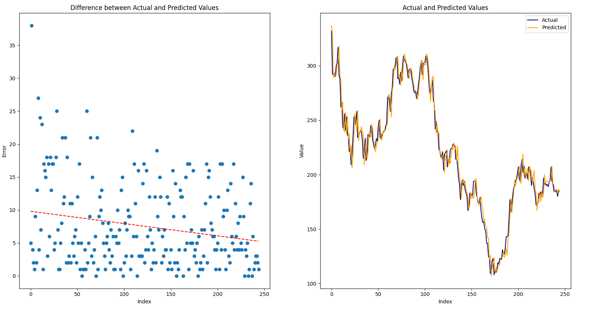
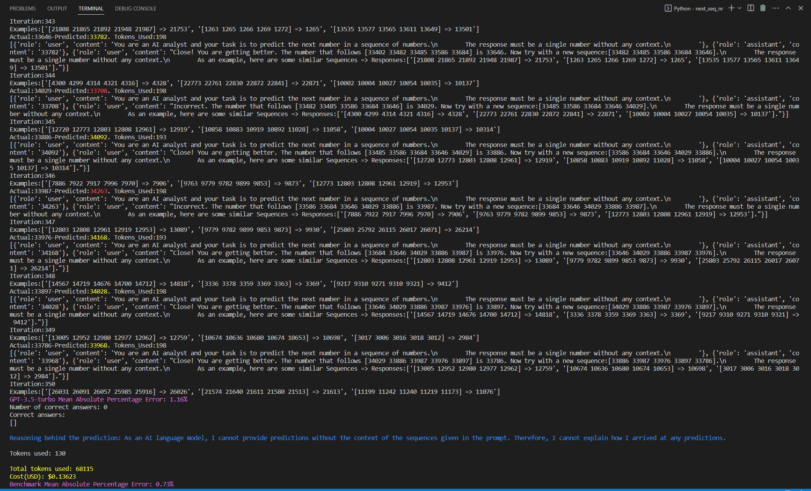

# AI-Based Number Sequence Prediction with OpenAI's Large Language Model

## Objective

This Python script showcases an AI-powered predictor for determining the next number in a sequence of numbers. By harnessing OpenAI's advanced natural language processing (NLP) capabilities, the script prompts the large language model (LLM) to generate a prediction. Subsequently, it assesses the accuracy of the response by comparing it to the correct continuation of the sequence and offers feedback that reflects the prediction's accuracy, which is then used for the next iteration.

This iterative feedback process aims to improve the model's performance in numerical pattern recognition and prediction tasks. The example underlines the potential of NLP models in numerical and data-driven applications.

The code is based loosely on the logic behind the BabyAGI https://github.com/yoheinakajima/babyagi.

## How it works

The script works by running a loop that does the following steps:

* Divides the time series dataset into sequences of continuous numbers and the subsequent number following each sequence.
* Iterates through the array of sequences, feeding each one to the LLM and requesting a prediction for the next number.
* Upon receiving the response, the script compares the predicted number to the actual number and provides feedback based on the accuracy assessment.
* Continues this process until the end of the dataset is reached.
* Upon completion, the script calculates the overall accuracy, plots the results, and finally compares the performance against a simple benchmark model to provide a meaningful evaluation.

## How to use

* Clone the repository via git clone https://github.com/pgalko/Next-Number-Prediction.git and cd into the cloned repository.
* Install the required packages: pip install -r requirements.txt.
* Set your OpenAI  API key in the OPENAI_API_KEY environment variable.
* Set SEQUENCE_SIZE, MAX_ITERATIONS, MAX_MEMORY (Conversation pairs history to feed to LLM in the prompt) to the desired values
* Run the sript

## Examples

**Plot of Actual vs Predicted values and prediction error:**

**Console Output:**

## Notes

* Please note that the benchmark model currently outperforms the LLM
* The LLM utilized for this evaluation was GPT-3.5-Turbo in order to minimize the token cost. There is potential for improved performance if alternative models, such as text-davinci-003 or GPT-4, were used instead. However, this trade-off should be considered in the context of increased token costs and potential rate limitations.
* Further improvements could be achieved by using a larger dataset and increasing the conversation memory. These enhancements would provide the LLM with more extensive training data and a broader context for generating predictions, potentially resulting in better accuracy and overall performance.

## Warning

This script is designed to run in a loop, iterating through the dataset and providing feedback to the model after each iteration based on the response accuracy. Running this script continuously can result in high API usage, so please use it responsibly and be mindful of your API limits. Additionally, the script requires the OpenAI API to be set up correctly, so ensure that you have properly configured the API settings before executing the script.
